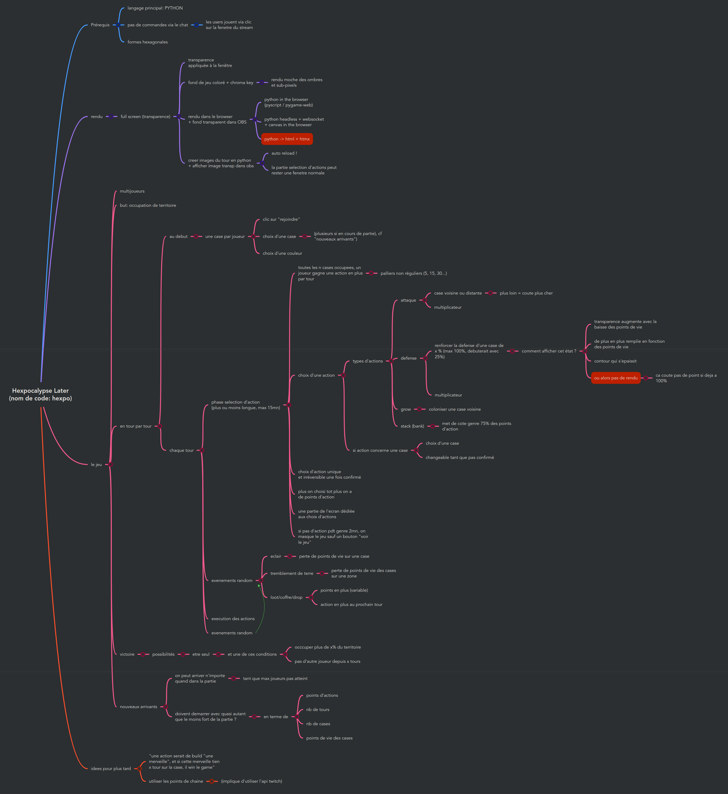

# `Hexpocalypse Later`

## Introduction

`Hexpocalypse Later`, codename `hexpo` (hence the repository name), is a turn-based game where players start with a 
single hexagonal tile and must expand their territory by colonizing new tiles, while defending.

The game is made to be played by viewers of a Twitch stream, by clicking directly on the stream.

It is partially developed and playable (at least when we'll have a first playable version) on [Twidi's Twitch](https://www.twitch.tv/twidi_angel), and on [Twidi's Discord](https://discord.gg/EJjmVNDRUN).

Here is the mindmap from the brainstorming made with viewers on the first stream about this game: 

The name `Hexpocalypse Later` was proposed by GPT-3 after a long time of brainstorming and giving up... Some people 
should have the reference (hint: an old movie) :wink:
